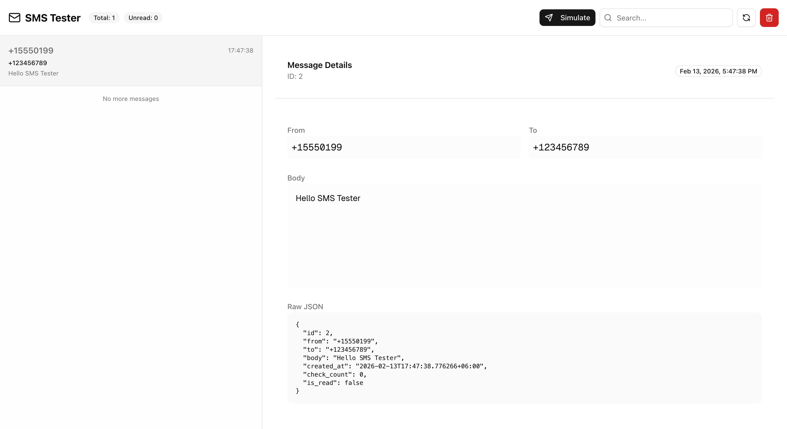

# SMS Tester

A high-performance, single-binary SMS testing service (similar to MailHog but for SMS). It provides a REST API to ingest simulating SMS messages and a real-time web dashboard to view them.



## Features

- **Single Binary**: The frontend is embedded in the Go binary. No external dependencies.
- **Real-time Updates**: Messages appear instantly via WebSockets.
- **High Performance**: 
  - Buffered broadcast channels (1000 msg capacity) to prevent API blocking.
  - Non-blocking ingest API.
  - Dedicated background worker for WebSocket broadcasts.
  - SQLite in WAL mode for high concurrency.
- **REST API**: Simple API to list, send, and clear messages.
- **Search & Filter**: Filter messages by sender, recipient, or body.
- **Security**: Basic Auth for dashboard and API Token for ingestion.

## Installation

### From Source

1. **Prerequisites**: Go 1.22+, Node.js 20+ (for building frontend)
2. **Build**:
   ```bash
   # Build Frontend
   cd frontend
   pnpm install
   pnpm build
   cd ..

   # Build Backend
   go build -o sms-tester main.go
   ```

## Usage

1. **Configuration**: Create a `.env` file (optional, defaults provided):
   ```env
   PORT=8025
   BASIC_AUTH_USER=admin
   BASIC_AUTH_PASSWORD=password
   API_TOKEN=secret-token
   ```

2. **Run**:
   ```bash
   ./sms-tester
   ```

3. **Access**:
   - Dashboard: [http://localhost:8025](http://localhost:8025)
   - API: `http://localhost:8025/api/v1`

## API Documentation

### Ingest Message
**POST** `/api/v1/send`

**Auth**: `Authorization: Bearer <API_TOKEN>` OR Basic Auth

**Payload**:
```json
{
  "from": "+15551234567",
  "to": "+15559876543",
  "body": "Your verification code is 1234."
}
```

### List Messages
**GET** `/api/v1/messages?page=1&limit=50`

**Auth**: Basic Auth

**Response**:
```json
{
  "data": [
    {
      "id": 1,
      "from": "+15551234567",
      "to": "+15559876543",
      "body": "Your verification code is 1234.",
      "is_read": false,
      "created_at": "2026-02-13T10:00:00Z"
    }
  ],
  "meta": {
    "total": 100,
    "unread": 5,
    "page": 1,
    "limit": 50
  }
}
```

### Mark as Read
**PUT** `/api/v1/messages/{id}/read`

**Auth**: Basic Auth

### Clear All Messages
**DELETE** `/api/v1/messages`

**Auth**: Basic Auth

## Production Deployment

- The binary is self-contained.
- Data is stored in `sms.db` (SQLite) in the working directory.
- Supports high traffic ingestion thanks to non-blocking architecture and WAL mode.
- Use a reverse proxy (Nginx/Caddy) for TLS termination.

## Development

**Backend**:
```bash
go run main.go
```

**Frontend**:
```bash
cd frontend
pnpm dev
```
*Note: In development, you need to run both. The `go run` command serves the API, and `pnpm dev` serves the frontend (proxying API calls if configured, or pointing to API URL).*
